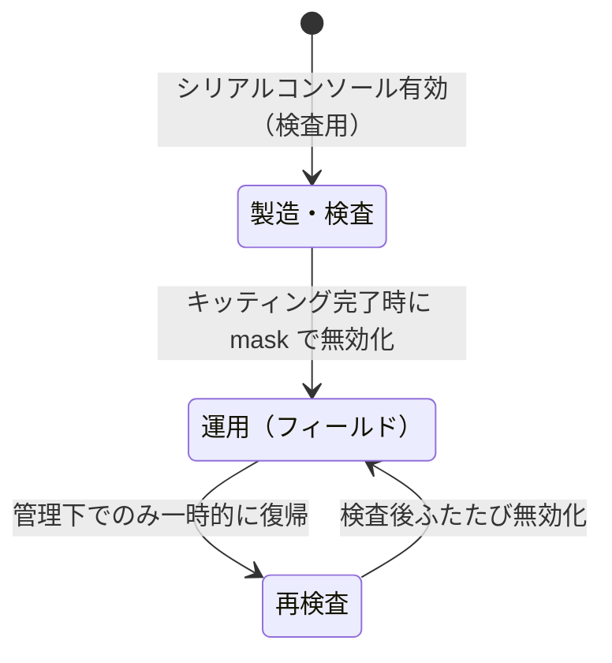

## はじめに

こんにちは。Shizen Connectの佐藤です。

私は現在エネルギーマネジメントシステムを支えるエッジ端末「Shizen Box」を開発しています。

昨年、Shizen Boxは第三者ペネトレーションテスト（以下、ペンテスト）を実施しました。本連載では、私がペンテスト対応した実務経験をもとに、設計・実装・運用の観点で得られた知見を整理しています。

### 連載構成

- [第一回：開発・検証環境について](https://qiita.com/satoriku0928/items/74dd58a0d9effc4e0d1a)
- **第二回：事前の守備固め（侵入対策・DoS対策など）**（本記事）
- 第三回：指摘された脆弱性と対策

### 第二回の内容

今回はペンテスト実施前に行った対策について備忘録を紹介します。

ざっくり実施したことは

1. 不要なサービス・プロセスを無効化
2. 論理的インタフェースの封鎖（ファイアーウォール）
3. DoS 対策（カーネルレベル）
4. 物理的インタフェースの封鎖
5. 侵入を試みられた場合の早期検知対策

結果として、ペンテスト実施前の段階で攻撃対象となり得る入口を最小限に抑えることができ、実際のペンテストにおいても有効な防御層として機能していたことを確認しました。

また、本記事で紹介する対策は、ペンテスト対応だけでなく、Shizen Boxが取得しているJC-STAR★1認証要件への対応も兼ねています。

> **JC-STAR（Labeling Scheme based on Japan Cyber-Security Technical Assessment Requirements）**
> IPA（独立行政法人 情報処理推進機構）が運営する IoT 製品向けのセキュリティ適合性評価・ラベリング制度です。★1 は基礎的なセキュリティ要件を定めており、本記事で紹介する対策の多くが認証要件に直接対応しています。

> **本記事について（免責事項）**
> - 本記事は IoT / 組み込み機器のセキュリティ対策の「考え方」を共有することを目的としており、特定の攻撃を助長する意図はありません。
> - 掲載しているコマンド・設定・ログ文字列はいずれも概念を示すための例です。実際の製品で使用しているポート番号・サービス名・パラメータ・監視対象・復帰手順などの具体情報は意図的に伏せています。
> - 記載内容は執筆時点のものであり、製品の実際の構成・対策状況とは異なる場合があります。
> - 本連載は、筆者がペンテスト対応を担当したデバイスについての内容です。
> - 本記事の情報を利用したことにより生じたいかなる損害についても、筆者および所属組織は一切の責任を負いません。
> - 本記事は筆者個人の見解であり、所属組織の公式見解を示すものではありません。

---

今回は5つ対策しましたが、1〜3は組み込みLinuxのセキュリティ対策としては割と定番の内容で、世の中に良い参考記事がたくさんあります。
なのでこの記事では1〜3は要点と、自分がハマったところの備忘録だけ残して、説明は参考記事に譲ります。
代わりに、フィールドに置きっぱなしのIoTデバイスならではの話である「4. 物理的インタフェースの封鎖」「5. 侵入を試みられた場合の早期検知対策」を、この記事の本題として掘り下げていきます。

## 1.不要なサービス・プロセスを無効化

組み込み Linux 開発では、高価な商用Linuxを使わない限り、ベンダー提供の汎用BSP（Board Support Package：ボードサポートパッケージ）をベースに自社向けの rootfs を構築するケースが多いと思います。
この汎用BSP には、製品用途では不要なパッケージやサービスが初期状態で含まれていることが少なくありません。
攻撃者の観点では、不要なサービスが動いているだけで侵入の起点になるので、不要なサービスの削除は地味に重要です。

確認には主に以下を使いました。

```bash
ps aux                                  # 動いているプロセスの確認
systemctl list-units --type=service     # 有効になっているサービスの確認
netstat -tulnp                          # LISTENしているポートとプロセスの確認
```

ここでのポイントは、不要と判断したサービス・パッケージを、運用時に止める（disable / stop）のではなく、**rootfs ビルドの時点で除外して「そもそも存在しない状態」にした**ことです。
止めただけだと設定変更やアップデートで復活することがありますが、そもそも入っていなければ復活しようがないので安心です。

やり方自体は定番なので詳細は参考記事に譲りますが、この対応は JC-STAR ★1 要件の**「不要なサービス・ポートを開放しないこと」**にもそのまま対応しています。

---

## 2.論理的インタフェースの封鎖（ファイアーウォール）

ファイアーウォール（iptables / nftables）の設計・実装そのものは一般的な話なので、参考記事に譲ります。

ここでは備忘録として、**封鎖したあとの確認でハマった話**だけ共有します。
ポートを封鎖したあとは `nmap` で確認するのですが、このとき**スキャン対象ポートのオプションを付け忘れない**方が良いです。
`nmap` はオプションなしだと全65535ポートではなく、**よく使われる上位1000ポート（top-ports 1000）しか見てくれません**。
なので、オプションなしのスキャンで「異常なし」に見えても、その1000個に入っていないポートが開きっぱなしだった、という残念な見落としが普通に起こります。
全ポートをちゃんと確認するには、下記のように範囲を明示して指定します。

```bash
# -p- は 1-65535 の全ポートを対象にする指定（-p 1-65535 と同じ）
sudo nmap -sT -p- <target-ip>
```

---

## 3.DoS 対策（カーネルレベル）

ファイアーウォールでの通信制御に加えて、DoS 攻撃への耐性はカーネルレベルでも確保しました。

第一回で紹介したフルスタック開発環境を活かして、カーネルソースの `.config` を編集してビルドしています。
SYN flood 対策（SYN Cookies）や ICMP の応答制御、`rp_filter` による不正な送信元アドレスの破棄など、LPIC などの Linux 技術者資格試験にも出てくるような、わりと一般的な設定を有効にしています。

このあたりの個別設定の意味や推奨値も参考記事やカーネルのドキュメントが詳しいので、ここでは「ファイアーウォール（ユーザー空間）任せにせず、カーネル側でも耐えられるようにした」という方針だけ共有しておきます。

---

## 4.物理的インタフェースの封鎖

1〜3はネットワーク越し、つまり論理的なインタフェースの話でしたが、物理的なインタフェースも同じくらい重要な侵入口です。
特に Shizen Box は一般家庭やフィールドに設置されるデバイスなので、**攻撃者が物理的に機器に触れる**という前提を捨てられません。
筐体を開けてシリアルコンソールに繋げばログインできてしまう、という状態は、物理的に近づける攻撃者にとってはかなりおいしい侵入口になります。

このあたりは、書籍『ハッカーの学校 IoTハッキングの教科書』を読んでも実感したところで、一般的なペンテストで狙われるのはネットワーク越しの侵入だけでなく、**シリアルコンソールをはじめとする物理インタフェースからの侵入が多い**ことが分かります。
攻撃者側の視点が具体的に書かれているので、「自分たちのデバイスのどこが狙われやすいか」を考えるうえで参考になりました。
そこで、JC-STAR の要件に対応するという観点だけでなく、こうした書籍から得た「攻撃者は物理インタフェースを狙ってくる」という知見も踏まえて、まずはシリアルコンソールの封鎖を対策として実施しました。

JC-STAR 要件でも、

> 全ての未使用の物理的インタフェース及び論理的インタフェースは無効化しなければならない

と定められています（※要件の趣旨を筆者が要約したものです。正確な文言は IPA が公開している JC-STAR の要件書を参照してください）。
ただ、ここで「シリアルコンソールを封鎖しろ」と名指しされているわけではありません。
とはいえ、検査用に使っているシリアルコンソールは製品として運用するときには「未使用の物理的インタフェース」になるので、ここは封鎖しておくべきだと判断しました。

そこで Shizen Box では、シリアルコンソール経由のログインを、**キッティング検査が終わったタイミングで無効化する**設計にしています。

### なぜ「運用時に止める」ではなく「キッティング完了時に止める」のか

製造・検査の段階ではシリアルコンソールがないと困ります。
ブートログを見たり、ネットワークがまだ繋がっていない状態で中に入って確認したりと、検査では普通に使うからです。
なので「最初から無効」にはできず、**検査では使えて、出荷後は塞がっている**という状態を作る必要がありました。
そのため、無効化のタイミングをキッティング検査の完了時点に置いています。

### 実装方法

具体的には、キッティング検査が終わったタイミングで、シリアルコンソールから以下を実行して無効化しています。

```bash
# シリアルコンソール（getty）の無効化
# mask すると symlink が /dev/null に張られ、enable や start でも起動できなくなる
systemctl mask <serial-ttyサービス>
```

`disable` ではなく `mask` にしているのがポイントです。
`disable` は自動起動を止めるだけで `systemctl start` すれば動いてしまいますが、`mask` だとサービス自体が `/dev/null` に潰されるので、うっかり有効化される事故を防げます。

ただし、これで対話ログインを塞ぐと、当然ですが**こちらも入れなくなります**。
なので、封鎖したシリアルコンソールを後からちゃんと開け直せるスクリプト（手順）をセットで用意しておくことが地味に重要になります。これを忘れると、再検査が必要になったときに自分たちが詰みます。

> **補足：本記事はOSのシリアルコンソールに絞っています**
> 物理インタフェースを厳密に見ると、ブートローダ（U-Boot）のコンソールやデバッグ端子なども論点になります。
> ただし、これらはそれぞれ独立したテーマで守備範囲も広いため、本記事では「OS のシリアルコンソールのログイン封鎖」に絞って紹介します。
> ブートローダ層については、第三回で改めて取り上げる予定です。

### 状態遷移の設計

整理すると、シリアルコンソールの状態は以下のように遷移させています。



* **製造・検査時**: シリアルコンソール有効（検査で使うため）
* **キッティング完了後**: シリアルコンソールを無効化（`mask`）
* **再検査時**: 決められた手順でのみ一時的に復帰可能

ポイントは、キッティング後に再検査が必要になるケースに備えて、**復帰手段を完全には捨てていない**ことです。
ただし誰でも開けられると封鎖した意味がなくなるので、復帰手順は製造工程の管理下でのみ実施できるようにしています（具体的な手順や前提条件は本記事では伏せています）。
こうすることで、フィールドでの物理アクセスによる不正ログインのリスクを下げつつ、自分たちのメンテナンス性は残す、というバランスを取っています。

---

## 5.侵入を試みられた場合の早期検知対策

ここも本記事の本題のひとつです。

そもそもこの仕組みを入れたきっかけは、**一般家庭向けの製品でもある Shizen Box に、実際どれくらい侵入が試みられるものなのか？** という素朴な疑問でした。
「入られないようにする」対策はもちろん大事なのですが、それと同じくらい「**触られたら分かる**」状態にしておきたかった、というのが動機です。
攻撃の試行が見えていないと、自分たちの防御がちゃんと効いているのかも分からないですし、そもそも狙われているのかどうかすら分かりません。

そこで、**特定ポートへのアクセス試行を検知してチャットツールに通知する**仕組みを導入しました。

### 仕組み

実現方法はシンプルで、

1. iptables の `LOG` ターゲットを特定ポートに仕掛けて、アクセス試行をカーネルログに吐かせる
2. そのログをアプリケーションから監視する
3. 試行を検知したらチャットツールに通知する

という流れです。

iptables 側は、ざっくり以下のようなイメージで、監視したいポートへのアクセスにログ用の目印（`--log-prefix`）を付けて記録させています。

```bash
# 監視対象ポートへのアクセス試行をログに記録する
# --log-prefix で後からアプリ側が拾いやすいように目印を付けておく
iptables -A INPUT -p tcp --dport <監視したいポート> -j LOG --log-prefix "INTRUSION_TRY: "
```

あとはアプリ側でこの `INTRUSION_TRY:` の付いたログを拾って、チャットツールに飛ばすだけです。
「特定ポートを少し開けておいて、そこに触ってきた相手を記録する」という意味では、簡易的なハニーポット的な使い方に近いかもしれません。

### 入れてみて気をつけたこと

実際に運用してみると、検知のたびに馬鹿正直に全部通知すると、**通知が多すぎて逆に見なくなる**という本末転倒なことが起きがちでした。
スキャンは連続して飛んでくるので、1試行1通知にするとチャットツールが一瞬で埋まります。
なので、通知を適切に集約・整理して「人が見て意味のある粒度」に落とす工夫は、実運用では必要になりました。
（このあたりの具体的な実装方針や、実際にどれくらい試行があったのかという観測結果は、また別の機会に詳しく書きたいと思います。）

---

## おわりに

今回は、ペンテストに備えて事前に実施した対策を、5つの観点でざっくり概要として整理してみました。

意識していたのは、「入られない」だけでなく「入口を作らない」「触ったら分かる」という3点です。
ただ、すべてを完璧に不可視にすることよりも、攻撃を試みられたときに**確実に検知・防御できる実用的な構成**を優先しました。このあたりは、第一回の開発環境構築と同じで、理想よりも実運用での確実性を取った判断です。

今回はあくまで全体像の紹介にとどめたので、一つひとつの設計の詳細（シリアルコンソールの復帰手順の作り込みや、ブートローダ側の封鎖、早期検知の通知制御や実際の観測結果など）には踏み込めていません。
このあたりの個別の設計の話は、それぞれ独立した記事として、またの機会に詳しく書いていきたいと思います。

IoT / 組み込みデバイスのセキュリティ対策に取り組んでいる方の参考になれば幸いです。

### 参考資料

- [JC-STAR（IoT製品に対するセキュリティ適合性評価制度） - IPA](https://www.ipa.go.jp/security/jc-star/index.html)
- [iptables(8) - Linux man page](https://man7.org/linux/man-pages/man8/iptables.8.html)
- [Nmap Reference Guide - Port Specification and Scan Order](https://nmap.org/book/man-port-specification.html)
- [systemd.unit(5)（mask / disable の挙動） - freedesktop.org](https://www.freedesktop.org/software/systemd/man/latest/systemctl.html)
- 書籍『[ハッカーの学校 IoTハッキングの教科書（第2版）](https://www.kinokuniya.co.jp/f/dsg-01-9784781702445)』（黒林檎・村島正浩 著、データハウス）
